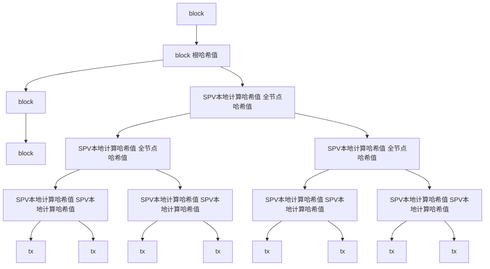

### merkle tree

```mermaid
graph TD;
    A[block]-->B[block 根哈希值];
    B-->C[block];
    C-->D[block];
    B[block 根哈希值]-->E[SPV本地计算哈希值 全节点哈希值];
    E-->F[SPV本地计算哈希值 全节点哈希值];
    E-->G[SPV本地计算哈希值 全节点哈希值];
    F-->H[SPV本地计算哈希值 SPV本地计算哈希值];
    F-->I[SPV本地计算哈希值 SPV本地计算哈希值];
    G-->J[SPV本地计算哈希值 SPV本地计算哈希值];
    G-->K[SPV本地计算哈希值 SPV本地计算哈希值];
    H-->L[tx];
    H-->M[tx];
    I-->O[tx];
    I-->P[tx];
    J-->Q[tx];
    J-->R[tx];
    K-->S[tx];
    K-->T[tx];
```
