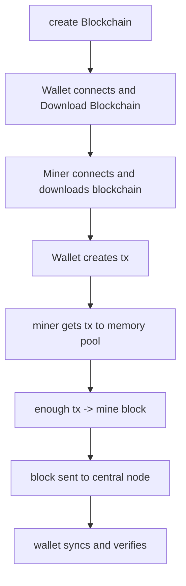

```mermaid
graph TD;
    A[create Blockchain]-->B[Wallet connects and Download Blockchain];
    B-->C[Miner connects and downloads blockchain];
    C-->D[Wallet creates tx];
    D-->E[miner gets tx to memory pool];
    E-->F[enough tx -> mine block];
    F-->G[block sent to central node];
    G-->H[wallet syncs and verifies];
```
