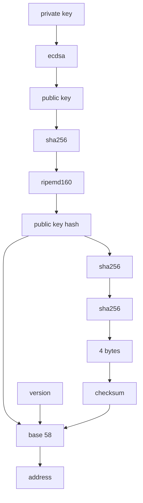

### wallet

```mermaid
graph TD;
    A[private key]-->B[ecdsa];
    B-->C[public key];
    C-->D[sha256];
    D-->E[ripemd160];
    E-->F[public key hash];
    F-->G[base 58];
    H[version]-->G;
    F-->I[sha256];
    I-->J[sha256];
    J-->K[4 bytes];
    K-->L[checksum];
    L-->G;
    G-->M[address];
```
